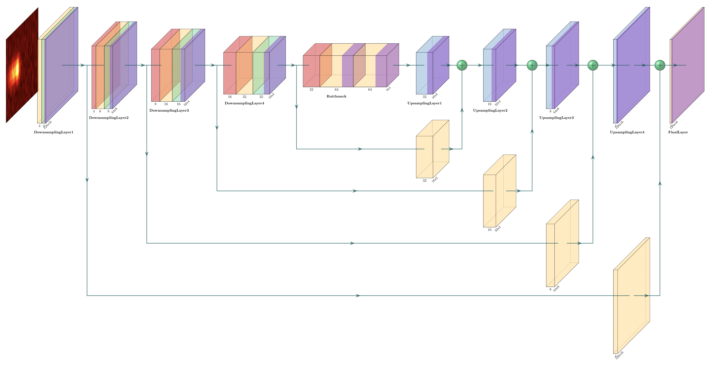

# SpecUNet Implementation for Spectroscopic Single-molecule Localization Microscopy(sSMLM) Imaging Denoising
This project implements a deep learning model with a U-Net-based architecture for processing single-molecule spectral localization microscopy (sSMLM) images. 
The goal is to predict background signals and produce denoised spectral images that preserve useful spectral information for downstream analysis. 
Implementation is highly configurable, supporting different training and testing datasets, adjustable hyperparameters, and reproducible evaluation workflows.
> Reference: Mao, H. et al. “Framework for Accurate Single-Molecule Spectroscopic Imaging Analyses Using Monte Carlo Simulation and Deep Learning,” *Analytical Chemistry* (2025). :contentReference[oaicite:4]{index=4}

## Table of Contents
1. [Project Structure](#project-structure)
2. [Models](#models)
3. [Setup](#setup)
4. [Usage](#usage)
5. [Contributions](#contributions)
6. [Acknowledgments](#acknowledgments)

## Project Structure
```markdown
.
├── dist/                       # Stores all packaged builds (not included in repo)
├── data/                       # Stores all datasets (not included in repo)
├── images/                     # Reference images for README.md
├── specunet_pkg/               # Main package directory
│   ├── config/                 # Configuration directory
│   ├── dataset.py              # Data loading and preprocessing functions
│   ├── hyperparameter_search.py# Hyperparameter tuning script
│   ├── main.py                 # Main entry point for training/testing
│   ├── metrics.py              # Metric calculation functions
│   ├── models.py               # Model definitions (UNet)
│   ├── parser.py               # Parsing configuration files
│   ├── requirements.txt        # List of dependencies
│   ├── test.py                 # Testing script for background predictions
│   ├── train.py                # Training script
│   └── utils.py                # Utility functions (e.g., seeds, logging)
├── test_models/                # Saved trained models and test results (not included)
├── .gitignore                  # Git ignore file
├── pyproject.toml              # Build system dependencies and config
├── README.md                   # Project documentation (this file)
├── specunet_pkg.egg-info    # Stores build metadata (not included in repo)
└── setup.cfg                   # Package setup configuration
```

### SpecUNet Architecture 

The SpecUNet structure takes a given image with dimensions of `16x128` and applies the following transformations:
1. 4 Downsampling Blocks (Encoder)

Within each downsampling block consists the following:

- Convolutional 2D Layer 
- BatchNorm 2D Layer
- ReLU Layer
- Max Pooling 2D Layer (kernel size of 2 and stride of 2)


2. Bottleneck

The bottleneck for this network consists of the following:

- Convolutional 2D Layer
- ReLU Layer
- Convolutional 2D Layer
- ReLU Layer

3. 4 Upsampling Blocks (Decoder)

Each upsampling block consists of the following:

- Convolutional Transposed 2D Layer (with kernel size of 2 and stride of 2)
- ReLU Layer
- Concatentation from nth decoder block
After each upsampling block, we add the resulting output from the nth encoder to the nth decoder.  


4. Final Convolutional Layer and ReLU Layer

We have also included the following diagram to visualize this network as well. The diagram is color-coded with
all the relevant layers, which are color-coded consistent with the legend below:

* Yellow - Convolutional Layer
* Green - BatchNorm Layer
* Purple - ReLU Layer
* Red - Pooling Layer
* Blue - Convolution Layer



## Setup/Installation
You can install SpecUNet either by downloading a prepackaged release (recommended for general use) or by cloning the source code directly (recommended for developers and contributors).

### Option 1: Prepackaged Release (Recommended)
If you just want to use the models and functions without modifying the underlying code, you can install the pre-built package directly from our releases.

1. Navigate to the [Releases section](https://github.com/switfluors/SpecUNet/releases) of this repository. 
2. Download the latest .whl (wheel) file from the assets list. 
3. Open your terminal, navigate to the folder where you downloaded the file, and install it using pip:

```Bash
pip install specunet-X.Y.Z-py3-none-any.whl 
```
(Note: Replace X.Y.Z with the actual version number you downloaded).

### Option 2: Source Code & Local Packaging
If you want to modify the source code, run the hyperparameter search, or build the package yourself, follow these steps:

1. Clone the repository:

```Bash
git clone https://github.com/switfluors/SpecUNet.git
cd .\Python
```

2. Create a virtual environment (Optional but highly recommended):
Creating an isolated environment ensures that these dependencies don't conflict with other Python projects on your machine.

```Bash
python -m venv venv
# On Windows:
venv\Scripts\activate
# On macOS/Linux:
source venv/bin/activate
```

3. Install dependencies:

```Bash
pip install -r specunet_pkg/requirements.txt
```
⚠️ Note regarding PyTorch: Currently, the requirements.txt is configured for CUDA 12.8. If your machine uses a different GPU architecture or if you are running on CPU only, this may fail or run slowly. Please adjust the PyTorch installation command according to your system specs via the official PyTorch documentation.

4. Install the package locally:
To make the specunet_pkg available anywhere on your system while keeping the code editable, install it in development mode:

```Bash
pip install -e .
```

5. (optional) Packaging your own build:
If you want to build and install your own version of SpecUNet as a package, you can run the following commands:
Note: Adjust the `setup.cfg` file's version number as required.

```Bash
pip install build
python -m build
```

The associated pip `.whl` and `.tar.gz` files will be located in the `dist/` folder.

### Core Dependencies
At the moment, the current Python libraries are being used:
- `h5py` and `scipy`: Importing MATLAB data files `.mat` to Python
- `torch`: Training Python models with the dataset
- `matplotlib`: General data visualization
- `numpy`: Data manipulation
- `openpyxl` and `pandas`: Storing spreadsheets of spectral metrics
- `scikit-learn` and `scipy`: Calculating various metrics
- `tqdm`: Progress monitoring
- `onnx`: For storing models in ONNX format (only works on non-5070ti GPUs)

## Usage

### Configuration Files

Configuration files, which are stored in the `config` directory, indicate specific setups of the dataset,
training or testing phase, model hyperparameters, dataset setups, and much more. We have included two default configurations
for both spectral-based and spatial-based datasets, which are identified in "SpecUNet.json" and "SpatUNet.json" files, respectively.

Additional configuration can be overridden when running main.py with provided flags, which are expressed in detail below.
Moreover, configuration files can be wholly ignored with main.py commands, which are discussed in later sections.

### Loading a Dataset

This library assumes that you are using data stored in a MATLAB ".mat" format in either "MATLAB v5+" or "MATLAB v7+"
formatting, which will use either `scipy` or `h5py` libraries, respectively.

The paths to the training and testing dataset can be simply passed with the `--train_path` and `--test_path`, respectively.

### Model Training

#### Hyperparameters

The model is trained with the following hyperparameters, which can be adjusted with the corresponding flag 
defined in the `args` variable in `main.py`:

- Learning Rate (`--lr`)
- L2-regularization (`--weight_decay`)
- Batch size (`--bs`)
- Epochs (`--epochs`)
- Loss function (`--loss_fn`)
- Optimizer (`--optimizer`)

We are also using a step learning rate scheduler, which reduces the learning rate by a gamma factor
after a certain step size:

- Scheduler step size (`--scheduler_step_size`)
- Scheduler gamma (`--scheduler_gamma`)

### Training/Testing a File

Supported flags used to train and test a model:

* `--exp_name` - Experiment name (used to save as a folder name under `test_models`)
* `--config` - Configuration file path
* `--train` - Train a model with a given train dataset
* `--test_sim` - Test a model with a given simulated dataset (target values provided)
* `--test_exp` - Test a model with a given experimental dataset (target values not provided)
* `--train_path` - Train dataset path (*.mat file)
* `--train_size` - Train dataset size
* `--test_path` - Test dataset path (*.mat file)
* `--test_size` - Test dataset size
* `--seed` - Random seed
* `--norm` - Identifies if data is normalized (for visualization purposes only)
* `--input_size` - Input shape
* `--validation_split` - Ratio to split dataset into training and validation (only applies when `--train` flag is set)
* `--num_workers` - Number of workers to load data into the GPU
* `--input_name` - Variable that stores the input (sptimg) data
* `--target_name` - Variable that stores the target (tbg) data
* `--GTspt` - Variable for ground truth spectra image data
* `--spt` - 1D spectrum profile for each spectra image (provide if available for simulated/experimental data)
* `--model_type` - Model that you want to train/test (currently, only "unet" is supported)
* `--epochs` - Number of epochs used for training
* `--bs` - Batch size
* `--lr` - Learning rate
* `--weight_decay` - L2-regularization factor
* `--loss_fn` - Loss function
* `--optimizer` - Optimization function used
* `--initializer` - Initializer used for training
* `--lr_scheduler` - Type of Learning Rate Scheduler used
* `--scheduler_step_size` - LR scheduler step size used
* `--scheduler_gamma` - LR scheduler gamma used

#### Training a Model (--train)

* If you are training a model, run the `main.py` script with the `--train` flag.
* Make sure to define the dataset and hyperparameters by calling the specific flags defined in the `args` variable in `main.py`. 
* If no dataset is provided, then the training dataset will be split into training and testing by the `--train_test_split` flag.
* At the end of training, for each model set to train (defined by `--model_type` flag), it will store the following into its respective folder:
- Trained model (weights stored in .pth file, ONNX file in .onnx file)
- Training and testing RMSE losses on a per-epoch basis (stored in .npy file)
- Training and testing RMSE loss graphs (stored in .png file)
* Additionally, in the main `exp_name` directory, the following files will be provided: 
- `configs` directory will store all final configurations for each image with its phase(s) and timestamp
- Logging file (stored in .log file)

#### Testing a Model (--test_sim or --test_exp)
If you are testing a model along with training, or simply testing an existing trained model, just add the `--test_sim`
flag for simulated data (where ground truth variables are present), or `--test_exp` flag for experimental data (where
ground truth variables are not present). This will produce several figures for evaluation purposes, including:

1. An RMSE histogram to compare the performance of all trained UNet models within a specific test folder (only with `--test_sim`)
2. For each model, it will also store the following, which will showcase:
- Up to five representative images, which include: 
  - Predicted Background (`--test_sim` only)
  - Ground Truth Background
  - Predicted Spectra (`--test_sim` only)
  - Ground Truth Spectra
  - Original Spectra
- Can optionally store all representative images for each model as TIFF files

Configuration files will define the overall structure and output of each train or test phase, and can be modified
accordingly.

Note: If you are training and testing a model at the same time with two different datasets, make sure that the 
input, target, and ground spectral data (if applicable) use consistent variable names within both datasets.

An example of running a model to train and test is shown below.

#### Example
As an example, we would like to train SpecUNet on the `Sample_TrainingData_10000.mat` dataset and test on the simulated `TestingData.mat` dataset, 
target variable `tbg4`, and ground truth spectral image variable `GTspt` that are stored  in the `data` folder with a learning rate of 0.001, 
L2-regularization factor of 0.0005, and loss function of MAE. 
Moreover, you would like to store the trained model with an experiment name of `Trained_Model1`.

In this case, the command will be as simple as:

```bash
python -m specunet_pkg --train --test_sim --exp_name "Trained_Model1" --model_type "unet" --train_path "data/Sample_TrainingData_10000.mat" --train_size 10000 --test_path "data/TestingData.mat" --test_size 5000 --input_name "sptimg4" --target_name "tbg4" --GTspt "GTspt" --lr 0.001 --weight_decay 0.0005 --loss_fn "mae"
```

Alternatively, you can use a configuration file to define the same training and testing parameters, as long as it is defined by your expectations:

```bash
python -m specunet_pkg --train --test_sim --exp_name "Trained_Model1" --config "config/SpecUNet.json"
```

If you would like to only test selected model under "Trained_Model1" on a specific dataset you would run the following command:

## If Predicting Simulated Data with ground truth
```bash
python -m specunet_pkg --test_sim --exp_name "Trained_Model1" --model_type unet --test_path "data/TestingData.mat" --test_size 5000 --input_name "sptimg4" --target_name "tbg4" --GTspt "GTspt"
```
Alternatively use config data:
```bash
python main.py --test_sim --exp_name "Trained_Model1" --config "config/SpecUNet.json"
```

If you would like to then to test the pretrained model under "Trained_Model1" on an experimental dataset called `ExpTestingData.mat` with 1163
samples and target variable of `final_bbimg`, you would run the following command:

## If Predicting Experimental Data without ground truth
```bash
python -m specunet_pkg --test_exp --exp_name "Trained_Model1" --test_path "Data/ExpTestingData.mat" --test_size 1163 --input_name "final_bbimg"  --model_type "unet"
```

Alternatively use config data:
```bash
python main.py --test_exp --exp_name "Trained_Model1" --config "config/SpecUNet.json"
```

### Hyperparameter Tuning

The `hyperparameter_search.py` file allows for optimizing the performance of a given model on a dataset by 
testing the search space of the given hyperparameter that can be called via `python main.py --train`, similar to
GridSearchCV class in `scikit-learn`, though not as efficient.

## Acknowledgments

We thank Dr. Dongkuan Xu and Dr. Caroline Laplante for their guidance on this project.
